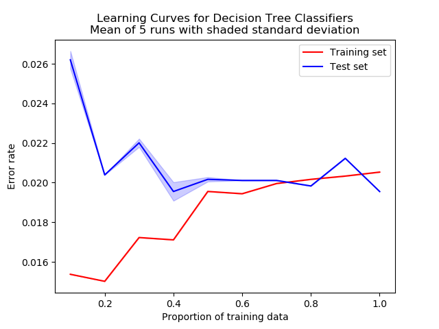

## Five Supervised ML Algorithms for Classifying Pulsars and Non-Pulsars

Pulsars are a rare type of neutro star that emit radio waves.  The HRTU2 data set was collected during the High Time resolution Universe Survey (South) and contains samples of pulsar candidates.  The data set is unbalanced, containing 16, 259 spurious examples caused by RFI/noise and 1,639 real pulsar examples, giving a baseline accuracy of 90.8%.

The data set was used to make 5 predictive classifiers using the Scikit-learn toolkit.  
1. Decision tree
2. Random forest
3. Support Vector Machine
4. AdaBoost ensemble of decision trees
5. Naive Bayes.

The best hyperparameters were found with a cross validated grid search and then learning curves were plotted to identify overfitting and the model simplified if necesary. 

### Results

#### Decision Tree
:-------------------------:|:-------------------------:
 | 

