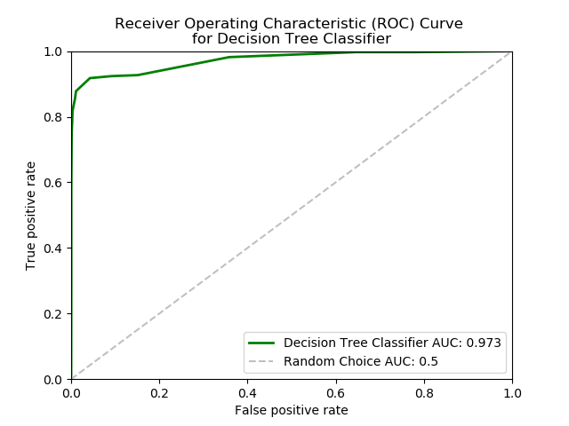
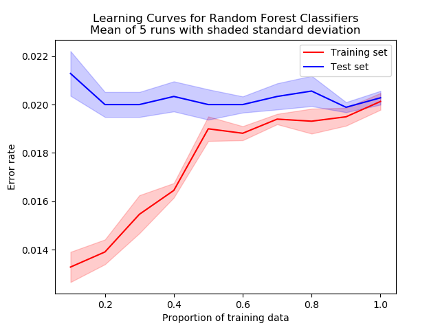
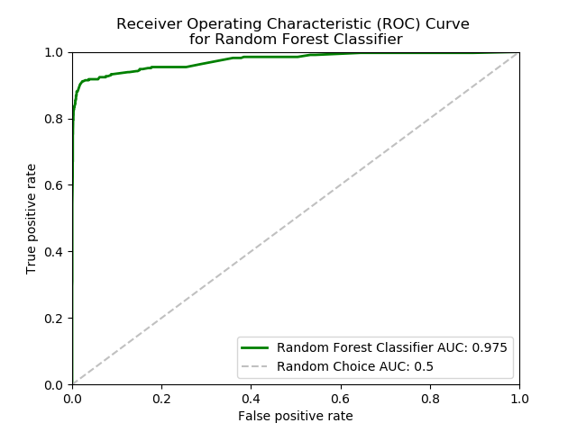
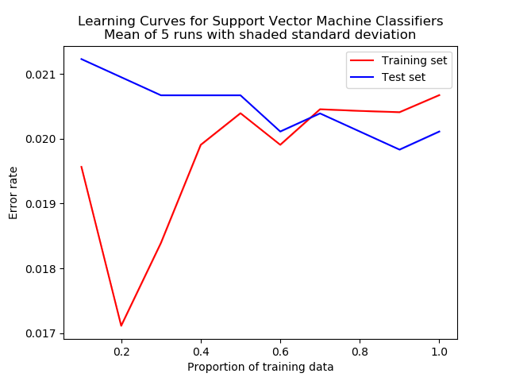
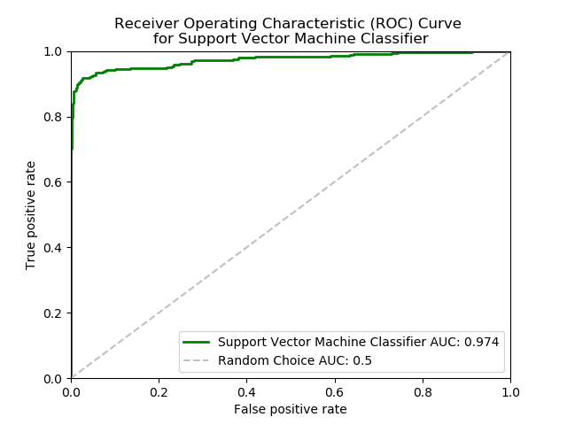
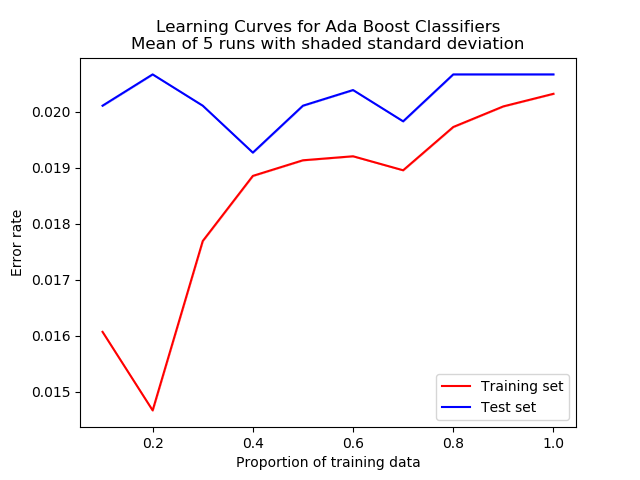
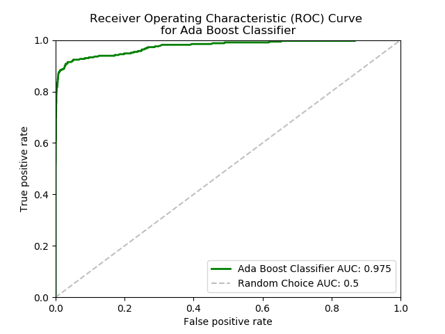

## Classifying Pulsars and Non-Pulsars using Supervised Machine Learning

Pulsars are a rare type of neutron star that emit radio waves.  The HRTU2 data set was collected during the High Time Resolution Universe Survey (South) and contains samples of pulsar candidates.  The data set is unbalanced, containing 16, 259 spurious examples caused by RFI/noise and 1,639 real pulsar examples, giving a baseline accuracy of 90.8%.

The data set was used to make 5 predictive classifiers using the Scikit-learn toolkit.  
1. Decision tree,
2. Random forest,
3. Support Vector Machine,
4. AdaBoost ensemble of decision trees,
5. Gaussian Naive Bayes.

The best hyperparameters were found with a cross validated grid search and then learning curves were plotted to identify overfitting and the model simplified if necessary. 

### Results
Learning curves            | Receiver Operating Characteristic curve
:-------------------------:|:-------------------------:
Decision tree learning curves             | Decision tree ROC curve
 | 
Random forest learning curves             | Random forest ROC curve
 | 
SVM             | 
 | 
AdaBoost Learning Curves   | AdaBoost ROC curve
 | 

### Metrics

   Algorithm  |   Accuracy   |  Error rate  |  Precision   |  Recall      |  F1          |AUC
:------------:|:------------:|:------------:|:------------:|:------------:|:------------:|:------------:
Decision tree |0.980         |0.020         |0.964         |0.817         |0.885         |0.973
Random Forest |0.980         |0.020         |0.924         |0.848         |0.921         |0.975
SVM           |0.980         |0.020         |0.951         |0.823         |0.882         |0.974
AdaBoost      |0.979         |0.021         |0.932         |0.835         |0.881         |0.975
Gaussian NB   |0.943         |0.057         |0.6382        |0.835         |0.735         |N/A

### Comparison of Classifiers
All classifiers performed better than the base accuracy of 0.908.  

The shape of the ROC curves reveals that these classifiers tend to classify negatives as false positives rather than positives as false negatives.  This is useful as it can direct further attention towards more likely pulsar candidates whilst also being less likely to miss pulsar candidates.

### Datasets
https://archive.ics.uci.edu/ml/datasets/HTRU2

### References

Brownlee, J, 2014 “Classification Accuracy is Not Enough, More Performance Measures you can use”

https://machinelearningmastery.com/classification-accuracy-is-not-enough-more-performance-measures-you-can-use/

Dua, D. and Karra Taniskidou, E. (2017). UCI Machine Learning Repository [http://archive.ics.uci.edu/ml]. Irvine, CA: University of California, School of Information and Computer Science. Fawcett, T., 2006. An introduction to ROC analysis. Pattern recognition letters, 27(8), pp.861-874. 

Géron, A., 2017. Hands-on machine learning with Scikit-Learn and TensorFlow: concepts, tools, and techniques to build intelligent systems. " O'Reilly Media, Inc.".

R. J. Lyon, HTRU2, DOI: 10.6084/m9.figshare.3080389.v1.

R. J. Lyon, B. W. Stappers, S. Cooper, J. M. Brooke, J. D. Knowles, Fifty Years of Pulsar Candidate Selection: From simple filters to a new principled real-time classification approach, Monthly Notices of the Royal Astronomical Society 459 (1), 1104-1123, DOI: 10.1093/mnras/stw656 Raschka, S., 2015. Python machine learning. Packt Publishing Ltd.

